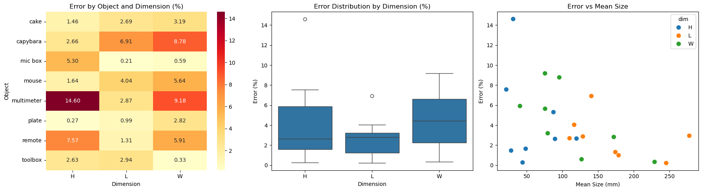

A project for object dimension measurement from point clouds captured by an Orbbec depth camera or loaded from saved `.npz` files.
 
## What the project does
 
- Detects a support plane (table/floor) in a point cloud.
- Extracts the target object relative to that plane.
- Computes `Length`, `Width`, and `Height` (upright) in millimeters.
- Returns intermediate cloud layers for visualization (`raw`, `downsampled`, `table`, `filtered`, `object`).
 
## Current features
 

- `CLI` mode: run from Orbbec camera input.
- `CLI` mode: replay from `.npz` (directory or single file).
- `GUI` mode (PySide6): real-time point cloud visualization.
- `GUI` mode (PySide6): processing layer switcher.
- `GUI` mode (PySide6): algorithm parameter editing, reset, and save to `src/config.py`.
- `GUI` mode (PySide6): `USE` mode supports averaging over multiple frames.
- Data recording utility: save point clouds to `.npz` via `src/utility/point_data_record.py`.
- Data recording utility: custom output file name via `--name`.
 

## Quick start
 

## Roadmap

### Done

- [x] Core point-cloud pipeline for upright dimensions.
- [x] CLI support for camera and `.npz` replay.
- [x] GUI with real-time visualization and layer selection.
- [x] Runtime parameter editing and saving to `src/config.py`.
- [x] Multi-frame averaging for measurements in `USE` mode.
- [x] Point-cloud recording utility with custom output name.

### Future

- [ ] Improve robustness for severe occlusion and large object dominance.
- [ ] Add features to create a point cloud from a depth frame with the known intrinsics
- [ ] Add data recording in the GUI
- [ ] Improve robustness with big objects
 
## Validation
 
`L/W/H` values are shown in millimeters.  
`Error %` is computed as `abs(mean(1,2,3) - T) / T * 100` for each dimension.
 
| Object | 1 (L/W/H) | 2 (L/W/H) | 3 (L/W/H) | Truth (L/W/H) | Error % (L/W/H) |
|---|---|---|---|---|---|
| mic box | 245.29 / 126.93 / 87.06 | 245.66 / 126.91 / 87.55 | 245.63 / 126.70 / 87.59 | 245.00 / 127.60 / 83.00 | 0.21 / 0.59 / 5.30 |
| remote | 174.34 / 40.99 / 21.54 | 174.44 / 39.98 / 20.73 | 173.98 / 40.40 / 21.51 | 172.00 / 43.00 / 23.00 | 1.31 / 5.91 / 7.57 |
| capybara | 140.23 / 91.41 / 119.45 | 140.17 / 97.43 / 120.17 | 141.30 / 97.97 / 119.55 | 151.00 / 104.80 / 123.00 | 6.91 / 8.78 / 2.66 |
| mouse | 116.93 / 75.44 / 48.66 | 116.16 / 76.08 / 48.34 | 116.48 / 75.51 / 48.47 | 112.00 / 80.20 / 49.30 | 4.04 / 5.64 / 1.64 |
| multimeter | 128.70 / 75.43 / 30.35 | 128.52 / 75.55 / 31.24 | 128.85 / 75.67 / 31.24 | 125.10 / 69.20 / 27.00 | 2.87 / 9.18 / 14.60 |
| cake | 110.77 / 78.74 / 28.46 | 108.86 / 78.71 / 28.90 | 110.32 / 80.70 / 26.65 | 107.10 / 82.00 / 27.60 | 2.69 / 3.19 / 1.46 |
| plate | 179.43 / 172.81 / 43.23 | 179.54 / 171.39 / 44.13 | 177.31 / 171.82 / 45.00 | 177.00 / 177.00 / 44.00 | 0.99 / 2.82 / 0.27 |
| toolbox | 277.68 / 229.20 / 89.54 | 277.91 / 229.26 / 89.51 | 278.26 / 229.27 / 89.73 | 270.00 / 230.00 / 87.30 | 2.94 / 0.33 / 2.63 |
 

